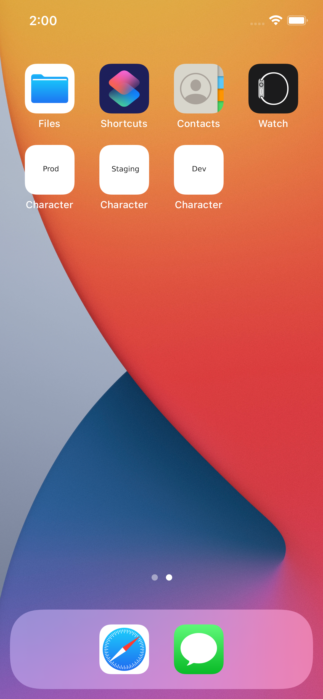
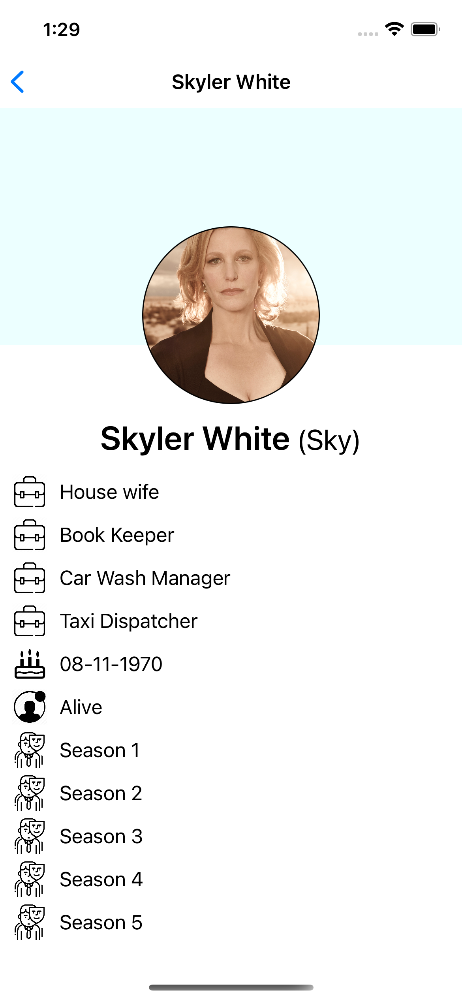
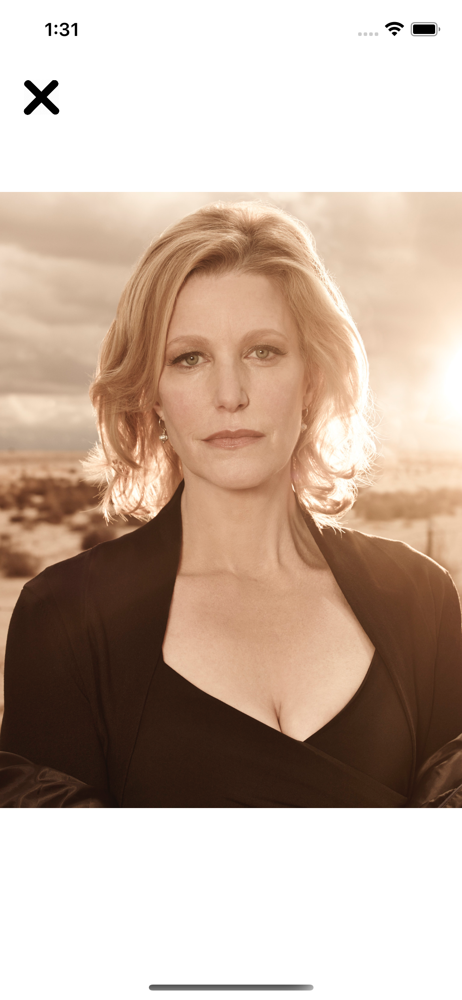
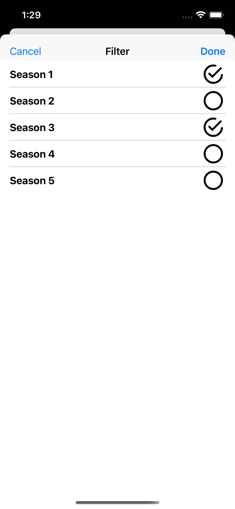

# Breaking Bad character explorer app
**Version 1.0**

Code and document for writing a Breaking Bad character app
 -  A list of Breaking Bad characters
    - Character profile image
    - Character name
 - Search for a character by name
 - Filter characters by season appearance
 - Details about the selected character
    - Image 
    - Name
    - Occupation
    - Status 
    - Nickname 
    - Season appearance
- Profile Image  
    - Profile Image
    
    

      img src="./Screenshot/home.png" width="200" alt="VGS Show iOS SDK Aliases" hspace="10">  
    

    
## Contributor
- Nithin George <nithingeorge3@gmail.com>

- [Requirements](#requirements)
- [Installation](#installation)
    - [Swift Package Manager](#swift-package-manager)
- [Architecture](#Architecture)
- [Target](#Target)
    
## Requirements
* iOS 13.0+
* macOS 10.15+
* Swift 5.1+

## Installation

### Swift Package Manager

In Xcode:
* File ⭢ Swift Packages ⭢ Add Package Dependency...
* Use the URL https://github.com/Alamofire/Alamofire.git
* Use the URL https://github.com/SDWebImage/SDWebImage.git

## Architecture 
* MVVM Architeture. Used Router for Navigation logic
* Followed TDD approch

## Target

* Production
* Staging
* Development
* UnitTest
* UITest

